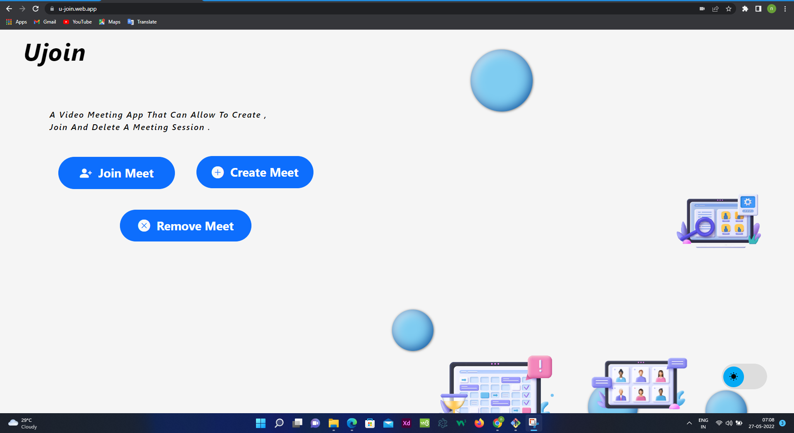
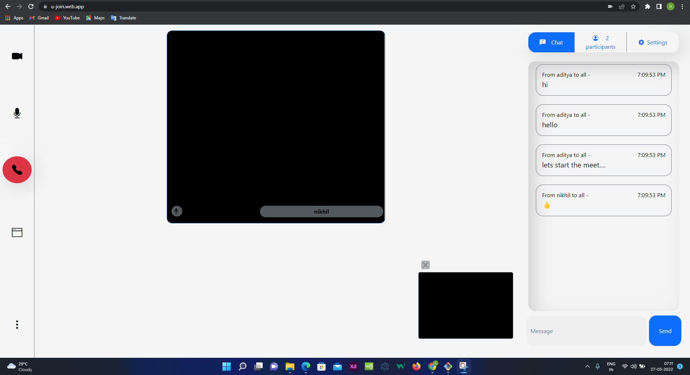

# ujoin
 A meeting app like google meet .

 ### Screen - Shots
 
 

### About app 
 It uses mesh architecture to connect peers using WEBRTC.
 The efficiency of app depends on the network and processing strength.
 Peerjs is used to connect peers.
 Firebase real-time database is used to to connect the new joiners to the existing room.
 HTML , js , bootstrap for front end. 

 ### Technologies Used
 html , js , peerjs , firebase , bootstrap 

 Hosted on : https://u-join.web.app
